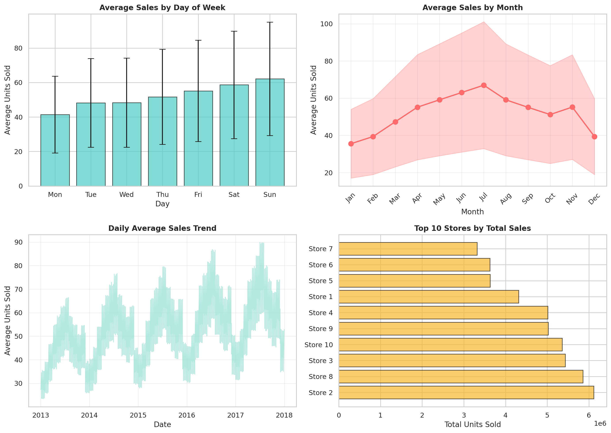
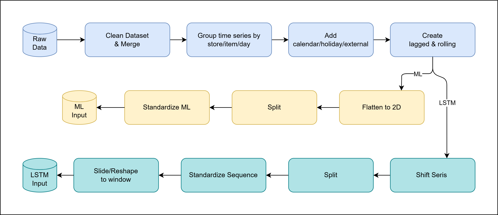
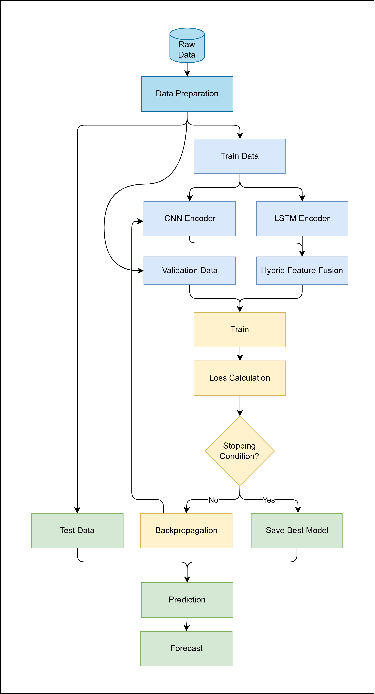

# Retail Demand Forecasting – Hybrid BiLSTM–CNN Model

Repository for the thesis project **“A Bidirectional LSTM‑CNN Ensemble with Cross‑Attention Gating and Multi‑Horizon Feature Fusion for Heterogeneous Retail Demand Forecasting.”**

---

## Repository Structure



```
RetailDemandForecasting/
│
├── Draw.io/
│   ├── LSTM.drawio.png
│   ├── data-preparation.png
│   └── prediction-vertical.drawio.png
│
├── eda/
│   ├── 01_sales_distribution.png
│   ├── 02_temporal_patterns.png
│   ├── 03_store_item_analysis.png
│   ├── 04_autocorrelation_analysis.png
│   └── 05_statistical_summary.png
│
├── figs/
│   ├── comparisons/
│   └── timelines/
│
├── notebooks/
├── src/
├── results/
└── thesis/
│
├── data/                     # Raw and processed datasets (ignored)
├── notebooks/                # EDA, Baselines, Hybrid Model
├── src/
│   ├── dataloader.py         # Unified preprocessing
│   ├── features.py           # Calendar + lag features
│   ├── model_hybrid.py       # ImprovedHybridLSTM architecture
│   ├── train.py              # Training pipeline
│   └── evaluate.py           # KPI generation & export
│
├── results/
│   ├── metrics.csv           # RMSE, MAE, R2, MAPE, SMAPE
│   ├── plots/                # Timelines and comparison charts
│   └── ablation_layout.md
│
└── thesis/
    └── Full_Report.pdf
```

---

## Model Highlights


* **Bidirectional LSTM path** for long‑range temporal dependencies
* **Dilated separable‑CNN path** for multi‑scale feature capture
* **Cross‑attention gating** to fuse CNN and LSTM representations
* **Tabular MLP tower** for engineered contextual signals
* **Fusion head** producing multi‑horizon forecasts

---

## Baseline Benchmarking

| Category         | Models                                                          |
| ---------------- | --------------------------------------------------------------- |
| ML Baselines     | Linear, Decision Tree, Random Forest, Extra Trees, GBM, HistGBM |
| Hybrid Baselines | Stacked CNN–LSTM, Parallel CNN–LSTM                             |
| Proposed         | ImprovedHybridLSTM                                              |

KPIs → RMSE, MAE, R², MAPE, SMAPE

---

## Usage

### Install

```
pip install -r requirements.txt
```

### Train

```
python train.py --horizon 365
```

### Evaluate

```
python evaluate.py --model hybrid
```

---

## Output Deliverables




* Multi‑horizon KPI metrics
* Timeline overlays
* Ablation layout
* Full thesis PDF

---

## Academic Attribution

Department of Computer Science & Engineering  
University of Rajshahi
